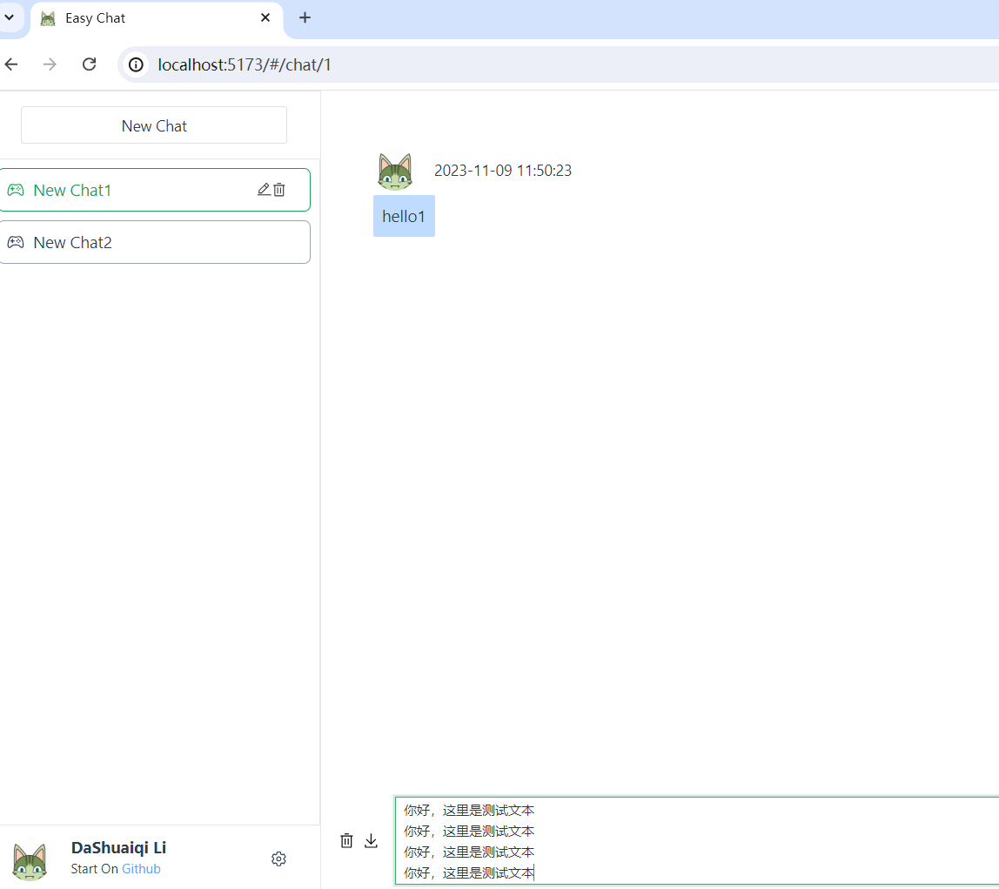

## 说明
模仿 https://github.com/Chanzhaoyu/chatgpt-web 的前端页面

## 环境
node 18.6.0
npm 9.6.2
vue3

## 二开步骤
1. 下载代码 
    ```shell
    git clone git@github.com:SinMu-L/chatweb.git
    ```
2. 进入项目目录按照依赖
    ```shell
    cd chatweb
    npm install
    ```
3. 运行页面
    ```shell
    npm run dev
    ```
4. 复制`.env`文件，粘贴重命名为`.env.development`作为开发环境使用即可。


## 目的
还是希望做一个响应式布局

响应式布局的根本是不同的媒体查询


## 小技巧

[事件监听](https://cn.vuejs.org/guide/essentials/event-handling.html#system-modifier-keys)
1. 监听回车事件：`@keyup.enter="event()"`
2. 监听ctrl+enter：`@keyup.ctrl.enter="event()"`


## 功能列表

- [ ] 响应式布局（没有思路，做起来断断续续的，打算找个课程看看）
- [x] localstorage 持久化存储（和对接后端是差不多的。目前数据放在内存中）
- [x] 访问权限控制（做第一遍的时候就写了，没有过多的调整样式。思路是加个全屏背景色，然后水平垂直居中来写一个input和提交的button；再用v-if来控制密码框和主区域的渲染）
- [x] OpenAI参数设置（做第一遍的时候写了。）
- [x] 对接流式输出
- [x] 多会话和上下文逻辑
- [x] grid+flex布局
- [x] 根路由默认跳转到第一个路由
- [x] 下载为图片
- [x] 清除会话
- [ ] 消息渲染，代码高亮
- [x] AI API 请求错误结果渲染


效果图
